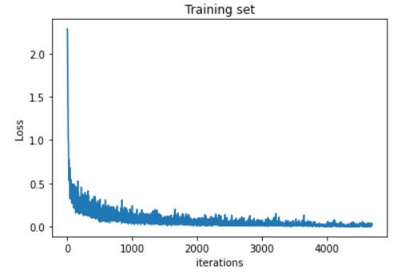

# MNIST-Classifier
Implementation of neural networks with Pytorch for classification of MNIST dataset
## Dataset
The [MNIST Dataset](http://yann.lecun.com/exdb/mnist/) is used. It is a dataset of 60,000 training samples and 10,000 test samples. Each sample is a 28×28 pixel grayscale image of a single handwritten digit between 0 and 9.
## Hyperparameters

|Hyperparameter     |Value |
| :----------- | :----------- |
| Learning rate      | 0.001      |
| Number of epochs   | 10       |
| Batch Size     | 128      |
## Results
The results show 99.89 training accuracy and 98.13 test accuracy.
## Training-Loss plot

